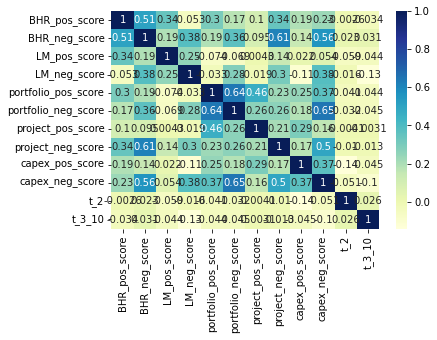
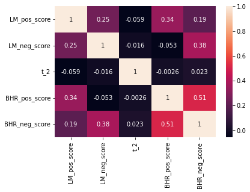

---
layout: wide_default
---    

# Rha Overstreet Midterm Report

## Fin 377 - Section 012 | Professor Bowen | Spring 2023

### Report Code


```python
import numpy as np
import pandas as pd
import matplotlib.pyplot as plt
import seaborn as sns

df = pd.read_csv('output/analysis_sample.csv')
df = df.drop(['Unnamed: 0','_merge'], axis = 1)
#-----
p1 = pd.DataFrame()
p1 = df[['Symbol', 'BHR_pos_score', 'BHR_neg_score', 'LM_pos_score', 'LM_neg_score', 'portfolio_pos_score',
         'portfolio_neg_score', 'project_pos_score', 'project_neg_score',
         'capex_pos_score', 'capex_neg_score', 't_2', 't_3_10']]
#-----
p_lm = df[['LM_pos_score', 'LM_neg_score','t_2','BHR_pos_score', 'BHR_neg_score']]
```

### 1. Summary

In this study we compared stocks listed in the S&P500 to their stock prices after their 10-K (mandatory Securities and Exchange Commission) filling where published. The null-hypothesis for this study was "A companies stock price affected by the linguistic sentiment presented in the companies 10-K filing." Linguistic sentiment was determined by 10 variables. 2 positive (negative) libraries created by Tim Loughran and Bill McDonald(LM), Diego Garcíaa, Xiaowen Hub, and Maximilian Rohrer(ML) respectivly, along with 3 positive (negative) categorical sentiment libraries created by myself. The sentiment score was determined by using a NEAR_regex function provided by our professor, which can be found in this project repository.

### 2. Data

The data sampled are the 500 firms listed within the S&P500. Throughout the study it was discovered that there was actually 503 symbols listed in the S&P500. By the end of the study, we where left with 496 observations. Within the S&P500 there are company's who have stock splits and are therefore represented twice in the index. This is most notably observed with the google ticker symbols GOOG and GOOGL. Even though there are separate tickers the company only files one 10-K. Another drop in observations come from some companies in the S&P500 not having there 2022 10-K viewable on the SEC website for some reason. The other drop in observations comes from the stock returns list we used. BALL (and others) was listed in the S&P500, yet the correct dates where not present in the returns dataframe. We also used the CRSP Compustat Merged data to get accounting information on all of the firms in our final dataset.

**Getting the compound returns** </br>

In order to obtain the compound returns, a new column had to be created. This column would hold a variable called 'adj_ret' which stands for adjusted returns. The adjusted returns is simply adding one to the regular returns. Adding one to the regular returns, creates a normalized variable that becomes a multiplier. These multipliers can than be used as a product to generate the compounded returns of the holding period. </br>

Cumulative/Gross return = Product(Rt); t = 1,2,..,T

**Choosing Sentiments** </br>

The sentiment variables in the study where created by using the 'NEAR_regex' function provided to us by our professor. In order for the function to work, there needed to be clean comprehensive text to analyze and compare too. We started by creating a spider that crawled the SEC website and downloaded the 10-K fillings of the compatible S&P500 firms. Once these where found we downloaded, zipped the html files, and deleted the local files all at the same time. This method for downloading the files allowed us to work with a 179.4mb file rather than a few gb file. Once the files where zipped we used the os,bytes.io,zipfile, and pandas packages to open then. We cleaned the html files by removing the xml-lmxl tags, punctuation, and added white spaces to get the words in the document separated. Once the words where separated we where able to run a regex on them. </br>

There two classes of sentiments in this study. The first class are the NLP machine learning/finance libraries created by the authors mentioned in the abstract. These libraries where provided by our professor for this study. The second class of sentiments are the categorical sentiments created for this specific study by the researcher. </br>

The three categories chosen where: portfolio management, project risk, and capital expenditures. These libraries where built as both positive and negative sentiments. The key anchor words stayed the same in the positive and negative libraries while the search words are generally antonyms or sentiments that reflect positively (negatively) respectively when discussing the anchors. I choose these categories to understand how much asset management sentiment in 10-K's affects the companies stock prices, or if they even have a causation at all.</br>

**Final Summary Statistics**


```python
# Descriptive statistics
df.iloc[:,:16].describe()
```


<div>
<style scoped>
    .dataframe tbody tr th:only-of-type {
        vertical-align: middle;
    }

    .dataframe tbody tr th {
        vertical-align: top;
    }

    .dataframe thead th {
        text-align: right;
    }
</style>
<table border="1" class="dataframe">
  <thead>
    <tr style="text-align: right;">
      <th></th>
      <th>CIK</th>
      <th>BHR_pos_score</th>
      <th>BHR_neg_score</th>
      <th>LM_pos_score</th>
      <th>LM_neg_score</th>
      <th>portfolio_pos_score</th>
      <th>portfolio_neg_score</th>
      <th>project_pos_score</th>
      <th>project_neg_score</th>
      <th>capex_pos_score</th>
      <th>capex_neg_score</th>
      <th>t_2</th>
      <th>t_3_10</th>
    </tr>
  </thead>
  <tbody>
    <tr>
      <th>count</th>
      <td>4.960000e+02</td>
      <td>496.000000</td>
      <td>496.000000</td>
      <td>496.000000</td>
      <td>496.000000</td>
      <td>496.000000</td>
      <td>496.000000</td>
      <td>496.000000</td>
      <td>496.000000</td>
      <td>496.000000</td>
      <td>496.000000</td>
      <td>493.000000</td>
      <td>493.000000</td>
    </tr>
    <tr>
      <th>mean</th>
      <td>7.921247e+05</td>
      <td>0.023510</td>
      <td>0.025476</td>
      <td>0.004929</td>
      <td>0.015821</td>
      <td>0.002814</td>
      <td>0.003269</td>
      <td>0.005390</td>
      <td>0.006697</td>
      <td>0.005109</td>
      <td>0.008814</td>
      <td>0.003961</td>
      <td>-0.008787</td>
    </tr>
    <tr>
      <th>std</th>
      <td>5.525659e+05</td>
      <td>0.004108</td>
      <td>0.003692</td>
      <td>0.001378</td>
      <td>0.003886</td>
      <td>0.000786</td>
      <td>0.001106</td>
      <td>0.000925</td>
      <td>0.001315</td>
      <td>0.001491</td>
      <td>0.001684</td>
      <td>0.044905</td>
      <td>0.065878</td>
    </tr>
    <tr>
      <th>min</th>
      <td>1.800000e+03</td>
      <td>0.003530</td>
      <td>0.008953</td>
      <td>0.000272</td>
      <td>0.002541</td>
      <td>0.000000</td>
      <td>0.000000</td>
      <td>0.002474</td>
      <td>0.001271</td>
      <td>0.001773</td>
      <td>0.003536</td>
      <td>-0.447716</td>
      <td>-0.288483</td>
    </tr>
    <tr>
      <th>25%</th>
      <td>9.767775e+04</td>
      <td>0.021520</td>
      <td>0.023554</td>
      <td>0.004011</td>
      <td>0.013240</td>
      <td>0.002321</td>
      <td>0.002591</td>
      <td>0.004761</td>
      <td>0.005981</td>
      <td>0.004056</td>
      <td>0.007717</td>
      <td>-0.019317</td>
      <td>-0.048646</td>
    </tr>
    <tr>
      <th>50%</th>
      <td>8.840640e+05</td>
      <td>0.023888</td>
      <td>0.025689</td>
      <td>0.004845</td>
      <td>0.015546</td>
      <td>0.002748</td>
      <td>0.003093</td>
      <td>0.005322</td>
      <td>0.006785</td>
      <td>0.004922</td>
      <td>0.008691</td>
      <td>0.000750</td>
      <td>-0.009661</td>
    </tr>
    <tr>
      <th>75%</th>
      <td>1.137871e+06</td>
      <td>0.025936</td>
      <td>0.027566</td>
      <td>0.005651</td>
      <td>0.017897</td>
      <td>0.003277</td>
      <td>0.003760</td>
      <td>0.005851</td>
      <td>0.007470</td>
      <td>0.005924</td>
      <td>0.009611</td>
      <td>0.026934</td>
      <td>0.029412</td>
    </tr>
    <tr>
      <th>max</th>
      <td>1.868275e+06</td>
      <td>0.037982</td>
      <td>0.038030</td>
      <td>0.010899</td>
      <td>0.035088</td>
      <td>0.005633</td>
      <td>0.010827</td>
      <td>0.009015</td>
      <td>0.012292</td>
      <td>0.011321</td>
      <td>0.016639</td>
      <td>0.369110</td>
      <td>0.332299</td>
    </tr>
  </tbody>
</table>
</div>


In the S&P500 data set, there are 496 complete observations. </br>
BHR Positive has the second largest mean sentiment score behind BHR Negative. This shows us that throughout the firms the BHR library has more sentiment hits. This makes sense due to the large size of this dictionary. 

### 3. Results


```python
# Correlation table with 10 variables and 2 returns
corr_plot = sns.heatmap(p1.corr(), cmap="YlGnBu", annot=True)
```


    

    


### Discussion Question 1
It is interesting how the BHR sentiment scores have an inverse relationship to the returns. It appears that a positive BHR score is negatively correlated to the return. The LM scores are both negatively correlated to the holding period.


```python
corr_lm = sns.heatmap(p_lm.corr(), annot=True)
```


    

    


### Discussion Question 2
With regards to table 3 in the ML_JFE paper, we are getting similar results. The correlation between the libraries is higher than the correlation between the libraries and the returns. 

### Discussion Question 3
I believe they decided to include so many more firms in their study for robustness. In a market with 3,000+ US participants and thousands more globally, to do a truly academic study, a large sample size is required. Large sample sizes decrease the probability of outliers and abnormalities affecting the results.

### Discussion Question 4
There is a difference in magnitude in our results, I believe this is most likely due to their use of larger sentiment libraries and larger firm counts. The lack of correlation becomes marginally larger as the observation count increases.


```python

```
