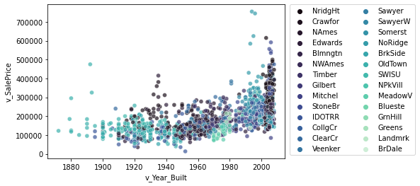
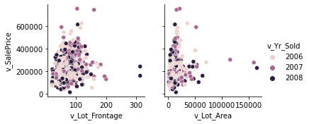
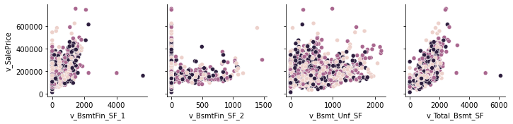
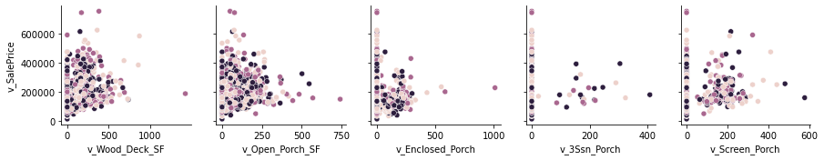
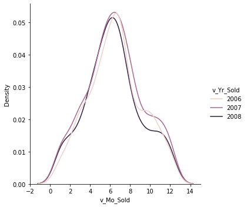
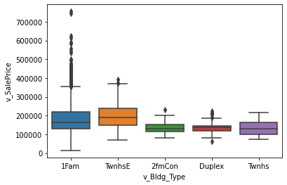
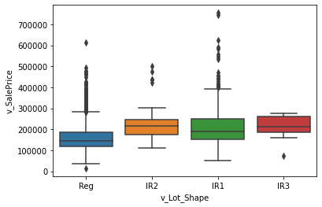
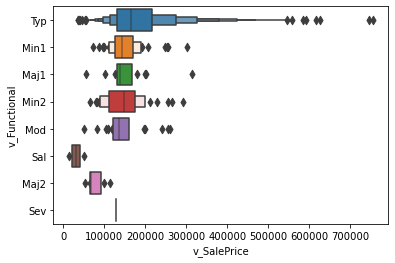

```python
# Importing libraries
import pandas as pd
import numpy as np
import seaborn as sns
import matplotlib.pyplot as plt
from statsmodels.formula.api import ols as sm_ols
from statsmodels.iolib.summary2 import summary_col # nicer tables
```


```python
# Reading in dataset
df = pd.read_csv('input_data2/housing_train.csv')
```

## Part 1: EDA

### Simple EDA


```python
def edaSimple(df):
    numerics = ['int16', 'int32', 'int64', 'float16', 'float32', 'float64']
    numeric_variables = df.select_dtypes(include=numerics).columns
    categorical_variables = df.drop(numeric_variables, axis = 1).columns
    dataShape = df.shape
    num_unique = df[numeric_variables].nunique()
    cat_unique = df[categorical_variables].nunique()
    units_of_observation = ['v_SalePrice', 'v_Year_Built','v_Yr_Sold','v_Mo_Sold', 'v_Lot_Area']
    
    print("There are", df.shape[0], "observations and", df.shape[1], "variables.", "\n",
         "The build dates range from", df.v_Year_Built.min(), "to", df.v_Year_Built.max(), "\n",
         "The sale dates range from", df.v_Yr_Sold.min(), "to", df.v_Yr_Sold.max(), "\n")
    
    print("The shape of the data is", "\n", dataShape, "\n",
         "Numeric Variables", "\n", numeric_variables , "\n",
         "Categorical Variables", "\n", categorical_variables , "\n",
         "Number of unique numerical variables", "\n", num_unique , "\n",
         "Number of unique categorical variables", "\n", cat_unique , "\n",
         "Main units of observation", "\n", df[units_of_observation].describe(), "\n",
         "Categorical variable counts", "\n")
    
    for var in categorical_variables:
            print(var, "| Note: limited to top 5 values.")
            print(df[var].value_counts().head(5), '\n---')
```


```python
edaSimple(df)
```

    There are 1941 observations and 81 variables. 
     The build dates range from 1872 to 2008 
     The sale dates range from 2006 to 2008 
    
    The shape of the data is 
     (1941, 81) 
     Numeric Variables 
     Index(['v_MS_SubClass', 'v_Lot_Frontage', 'v_Lot_Area', 'v_Overall_Qual',
           'v_Overall_Cond', 'v_Year_Built', 'v_Year_Remod/Add', 'v_Mas_Vnr_Area',
           'v_BsmtFin_SF_1', 'v_BsmtFin_SF_2', 'v_Bsmt_Unf_SF', 'v_Total_Bsmt_SF',
           'v_1st_Flr_SF', 'v_2nd_Flr_SF', 'v_Low_Qual_Fin_SF', 'v_Gr_Liv_Area',
           'v_Bsmt_Full_Bath', 'v_Bsmt_Half_Bath', 'v_Full_Bath', 'v_Half_Bath',
           'v_Bedroom_AbvGr', 'v_Kitchen_AbvGr', 'v_TotRms_AbvGrd', 'v_Fireplaces',
           'v_Garage_Yr_Blt', 'v_Garage_Cars', 'v_Garage_Area', 'v_Wood_Deck_SF',
           'v_Open_Porch_SF', 'v_Enclosed_Porch', 'v_3Ssn_Porch', 'v_Screen_Porch',
           'v_Pool_Area', 'v_Misc_Val', 'v_Mo_Sold', 'v_Yr_Sold', 'v_SalePrice'],
          dtype='object') 
     Categorical Variables 
     Index(['parcel', 'v_MS_Zoning', 'v_Street', 'v_Alley', 'v_Lot_Shape',
           'v_Land_Contour', 'v_Utilities', 'v_Lot_Config', 'v_Land_Slope',
           'v_Neighborhood', 'v_Condition_1', 'v_Condition_2', 'v_Bldg_Type',
           'v_House_Style', 'v_Roof_Style', 'v_Roof_Matl', 'v_Exterior_1st',
           'v_Exterior_2nd', 'v_Mas_Vnr_Type', 'v_Exter_Qual', 'v_Exter_Cond',
           'v_Foundation', 'v_Bsmt_Qual', 'v_Bsmt_Cond', 'v_Bsmt_Exposure',
           'v_BsmtFin_Type_1', 'v_BsmtFin_Type_2', 'v_Heating', 'v_Heating_QC',
           'v_Central_Air', 'v_Electrical', 'v_Kitchen_Qual', 'v_Functional',
           'v_Fireplace_Qu', 'v_Garage_Type', 'v_Garage_Finish', 'v_Garage_Qual',
           'v_Garage_Cond', 'v_Paved_Drive', 'v_Pool_QC', 'v_Fence',
           'v_Misc_Feature', 'v_Sale_Type', 'v_Sale_Condition'],
          dtype='object') 
     Number of unique numerical variables 
     v_MS_SubClass          16
    v_Lot_Frontage        118
    v_Lot_Area           1413
    v_Overall_Qual         10
    v_Overall_Cond          9
    v_Year_Built          110
    v_Year_Remod/Add       60
    v_Mas_Vnr_Area        368
    v_BsmtFin_SF_1        787
    v_BsmtFin_SF_2        194
    v_Bsmt_Unf_SF         938
    v_Total_Bsmt_SF       870
    v_1st_Flr_SF          901
    v_2nd_Flr_SF          508
    v_Low_Qual_Fin_SF      23
    v_Gr_Liv_Area        1045
    v_Bsmt_Full_Bath        3
    v_Bsmt_Half_Bath        3
    v_Full_Bath             4
    v_Half_Bath             3
    v_Bedroom_AbvGr         8
    v_Kitchen_AbvGr         3
    v_TotRms_AbvGrd        13
    v_Fireplaces            5
    v_Garage_Yr_Blt        99
    v_Garage_Cars           5
    v_Garage_Area         520
    v_Wood_Deck_SF        306
    v_Open_Porch_SF       230
    v_Enclosed_Porch      147
    v_3Ssn_Porch           20
    v_Screen_Porch         96
    v_Pool_Area            14
    v_Misc_Val             28
    v_Mo_Sold              12
    v_Yr_Sold               3
    v_SalePrice           820
    dtype: int64 
     Number of unique categorical variables 
     parcel              1941
    v_MS_Zoning            7
    v_Street               2
    v_Alley                2
    v_Lot_Shape            4
    v_Land_Contour         4
    v_Utilities            2
    v_Lot_Config           5
    v_Land_Slope           3
    v_Neighborhood        28
    v_Condition_1          9
    v_Condition_2          8
    v_Bldg_Type            5
    v_House_Style          8
    v_Roof_Style           6
    v_Roof_Matl            8
    v_Exterior_1st        16
    v_Exterior_2nd        17
    v_Mas_Vnr_Type         5
    v_Exter_Qual           4
    v_Exter_Cond           5
    v_Foundation           6
    v_Bsmt_Qual            5
    v_Bsmt_Cond            5
    v_Bsmt_Exposure        4
    v_BsmtFin_Type_1       6
    v_BsmtFin_Type_2       6
    v_Heating              6
    v_Heating_QC           5
    v_Central_Air          2
    v_Electrical           5
    v_Kitchen_Qual         4
    v_Functional           8
    v_Fireplace_Qu         5
    v_Garage_Type          6
    v_Garage_Finish        3
    v_Garage_Qual          5
    v_Garage_Cond          5
    v_Paved_Drive          3
    v_Pool_QC              4
    v_Fence                4
    v_Misc_Feature         5
    v_Sale_Type           10
    v_Sale_Condition       6
    dtype: int64 
     Main units of observation 
              v_SalePrice  v_Year_Built    v_Yr_Sold    v_Mo_Sold     v_Lot_Area
    count    1941.000000   1941.000000  1941.000000  1941.000000    1941.000000
    mean   182033.238022   1971.321999  2006.998454     6.431221   10284.770222
    std     80407.100395     30.209933     0.801736     2.745199    7832.295527
    min     13100.000000   1872.000000  2006.000000     1.000000    1470.000000
    25%    130000.000000   1953.000000  2006.000000     5.000000    7420.000000
    50%    161900.000000   1973.000000  2007.000000     6.000000    9450.000000
    75%    215000.000000   2001.000000  2008.000000     8.000000   11631.000000
    max    755000.000000   2008.000000  2008.000000    12.000000  164660.000000 
     Categorical variable counts 
    
    parcel | Note: limited to top 5 values.
    1056_528110080    1
    1124_528477040    1
    1108_528365080    1
    1107_528365060    1
    1105_528363020    1
    Name: parcel, dtype: int64 
    ---
    v_MS_Zoning | Note: limited to top 5 values.
    RL         1499
    RM          320
    FV           87
    RH           17
    C (all)      15
    Name: v_MS_Zoning, dtype: int64 
    ---
    v_Street | Note: limited to top 5 values.
    Pave    1933
    Grvl       8
    Name: v_Street, dtype: int64 
    ---
    v_Alley | Note: limited to top 5 values.
    Grvl    82
    Pave    54
    Name: v_Alley, dtype: int64 
    ---
    v_Lot_Shape | Note: limited to top 5 values.
    Reg    1213
    IR1     661
    IR2      55
    IR3      12
    Name: v_Lot_Shape, dtype: int64 
    ---
    v_Land_Contour | Note: limited to top 5 values.
    Lvl    1736
    HLS      90
    Bnk      77
    Low      38
    Name: v_Land_Contour, dtype: int64 
    ---
    v_Utilities | Note: limited to top 5 values.
    AllPub    1940
    NoSewr       1
    Name: v_Utilities, dtype: int64 
    ---
    v_Lot_Config | Note: limited to top 5 values.
    Inside     1431
    Corner      326
    CulDSac     119
    FR2          53
    FR3          12
    Name: v_Lot_Config, dtype: int64 
    ---
    v_Land_Slope | Note: limited to top 5 values.
    Gtl    1850
    Mod      81
    Sev      10
    Name: v_Land_Slope, dtype: int64 
    ---
    v_Neighborhood | Note: limited to top 5 values.
    NAmes      290
    CollgCr    183
    OldTown    155
    Edwards    129
    Somerst    121
    Name: v_Neighborhood, dtype: int64 
    ---
    v_Condition_1 | Note: limited to top 5 values.
    Norm      1674
    Feedr      111
    Artery      55
    RRAn        39
    PosN        21
    Name: v_Condition_1, dtype: int64 
    ---
    v_Condition_2 | Note: limited to top 5 values.
    Norm      1918
    Feedr        9
    Artery       4
    PosN         3
    PosA         3
    Name: v_Condition_2, dtype: int64 
    ---
    v_Bldg_Type | Note: limited to top 5 values.
    1Fam      1607
    TwnhsE     158
    Twnhs       66
    Duplex      64
    2fmCon      46
    Name: v_Bldg_Type, dtype: int64 
    ---
    v_House_Style | Note: limited to top 5 values.
    1Story    968
    2Story    581
    1.5Fin    212
    SLvl       85
    SFoyer     54
    Name: v_House_Style, dtype: int64 
    ---
    v_Roof_Style | Note: limited to top 5 values.
    Gable      1543
    Hip         356
    Gambrel      16
    Flat         15
    Mansard       7
    Name: v_Roof_Style, dtype: int64 
    ---
    v_Roof_Matl | Note: limited to top 5 values.
    CompShg    1908
    Tar&Grv      16
    WdShake       7
    WdShngl       6
    Membran       1
    Name: v_Roof_Matl, dtype: int64 
    ---
    v_Exterior_1st | Note: limited to top 5 values.
    VinylSd    670
    MetalSd    308
    HdBoard    293
    Wd Sdng    277
    Plywood    136
    Name: v_Exterior_1st, dtype: int64 
    ---
    v_Exterior_2nd | Note: limited to top 5 values.
    VinylSd    666
    MetalSd    310
    HdBoard    266
    Wd Sdng    263
    Plywood    180
    Name: v_Exterior_2nd, dtype: int64 
    ---
    v_Mas_Vnr_Type | Note: limited to top 5 values.
    None       1154
    BrkFace     602
    Stone       146
    BrkCmn       20
    CBlock        1
    Name: v_Mas_Vnr_Type, dtype: int64 
    ---
    v_Exter_Qual | Note: limited to top 5 values.
    TA    1201
    Gd     658
    Ex      65
    Fa      17
    Name: v_Exter_Qual, dtype: int64 
    ---
    v_Exter_Cond | Note: limited to top 5 values.
    TA    1704
    Gd     187
    Fa      41
    Ex       8
    Po       1
    Name: v_Exter_Cond, dtype: int64 
    ---
    v_Foundation | Note: limited to top 5 values.
    PConc     882
    CBlock    813
    BrkTil    210
    Slab       28
    Stone       6
    Name: v_Foundation, dtype: int64 
    ---
    v_Bsmt_Qual | Note: limited to top 5 values.
    TA    847
    Gd    817
    Ex    168
    Fa     57
    Po      2
    Name: v_Bsmt_Qual, dtype: int64 
    ---
    v_Bsmt_Cond | Note: limited to top 5 values.
    TA    1723
    Gd      93
    Fa      70
    Ex       3
    Po       2
    Name: v_Bsmt_Cond, dtype: int64 
    ---
    v_Bsmt_Exposure | Note: limited to top 5 values.
    No    1227
    Av     292
    Gd     203
    Mn     167
    Name: v_Bsmt_Exposure, dtype: int64 
    ---
    v_BsmtFin_Type_1 | Note: limited to top 5 values.
    Unf    577
    GLQ    549
    ALQ    292
    Rec    197
    BLQ    172
    Name: v_BsmtFin_Type_1, dtype: int64 
    ---
    v_BsmtFin_Type_2 | Note: limited to top 5 values.
    Unf    1666
    Rec      68
    LwQ      61
    BLQ      40
    ALQ      33
    Name: v_BsmtFin_Type_2, dtype: int64 
    ---
    v_Heating | Note: limited to top 5 values.
    GasA    1913
    GasW      18
    Grav       4
    Wall       3
    OthW       2
    Name: v_Heating, dtype: int64 
    ---
    v_Heating_QC | Note: limited to top 5 values.
    Ex    993
    TA    553
    Gd    333
    Fa     59
    Po      3
    Name: v_Heating_QC, dtype: int64 
    ---
    v_Central_Air | Note: limited to top 5 values.
    Y    1812
    N     129
    Name: v_Central_Air, dtype: int64 
    ---
    v_Electrical | Note: limited to top 5 values.
    SBrkr    1771
    FuseA     127
    FuseF      34
    FuseP       7
    Mix         1
    Name: v_Electrical, dtype: int64 
    ---
    v_Kitchen_Qual | Note: limited to top 5 values.
    TA    994
    Gd    771
    Ex    132
    Fa     44
    Name: v_Kitchen_Qual, dtype: int64 
    ---
    v_Functional | Note: limited to top 5 values.
    Typ     1813
    Min1      42
    Min2      40
    Mod       22
    Maj1      15
    Name: v_Functional, dtype: int64 
    ---
    v_Fireplace_Qu | Note: limited to top 5 values.
    Gd    504
    TA    388
    Fa     50
    Po     31
    Ex     28
    Name: v_Fireplace_Qu, dtype: int64 
    ---
    v_Garage_Type | Note: limited to top 5 values.
    Attchd     1143
    Detchd      520
    BuiltIn     122
    Basment      21
    2Types       20
    Name: v_Garage_Type, dtype: int64 
    ---
    v_Garage_Finish | Note: limited to top 5 values.
    Unf    813
    RFn    536
    Fin    485
    Name: v_Garage_Finish, dtype: int64 
    ---
    v_Garage_Qual | Note: limited to top 5 values.
    TA    1719
    Fa      89
    Gd      20
    Po       4
    Ex       2
    Name: v_Garage_Qual, dtype: int64 
    ---
    v_Garage_Cond | Note: limited to top 5 values.
    TA    1758
    Fa      50
    Gd      14
    Po      10
    Ex       2
    Name: v_Garage_Cond, dtype: int64 
    ---
    v_Paved_Drive | Note: limited to top 5 values.
    Y    1751
    N     147
    P      43
    Name: v_Paved_Drive, dtype: int64 
    ---
    v_Pool_QC | Note: limited to top 5 values.
    Ex    4
    Gd    4
    TA    3
    Fa    2
    Name: v_Pool_QC, dtype: int64 
    ---
    v_Fence | Note: limited to top 5 values.
    MnPrv    210
    GdPrv     76
    GdWo      69
    MnWw      10
    Name: v_Fence, dtype: int64 
    ---
    v_Misc_Feature | Note: limited to top 5 values.
    Shed    55
    Gar2     4
    Othr     2
    Elev     1
    TenC     1
    Name: v_Misc_Feature, dtype: int64 
    ---
    v_Sale_Type | Note: limited to top 5 values.
    WD       1647
    New       201
    COD        51
    ConLD      16
    CWD        12
    Name: v_Sale_Type, dtype: int64 
    ---
    v_Sale_Condition | Note: limited to top 5 values.
    Normal     1551
    Partial     205
    Abnorml     127
    Family       34
    Alloca       12
    Name: v_Sale_Condition, dtype: int64 
    ---


### Graphs


```python
sns.scatterplot(data = df, x = 'v_Year_Built', y = 'v_SalePrice', 
                hue = 'v_Neighborhood', palette = "mako", alpha = 0.7)
plt.legend(bbox_to_anchor=(1.02, 1), loc='upper left', borderaxespad=0, ncol = 2)
```


    <matplotlib.legend.Legend at 0x7f8ca8a6bee0>


    

    


Note - all PairGrid plots have the same hue meanings. Legend will only be displayed for one for brevity.


```python
lot_vars = ['v_Lot_Frontage', 'v_Lot_Area']
bmnt_vars = ['v_BsmtFin_SF_1', 'v_BsmtFin_SF_2', 'v_Bsmt_Unf_SF', 'v_Total_Bsmt_SF']
flr_vars = ['v_1st_Flr_SF', 'v_2nd_Flr_SF', 'v_Low_Qual_Fin_SF', 'v_Gr_Liv_Area']
out_vars = ['v_Wood_Deck_SF','v_Open_Porch_SF', 'v_Enclosed_Porch', 
            'v_3Ssn_Porch', 'v_Screen_Porch']
```


```python
a = sns.PairGrid(df, x_vars = lot_vars, y_vars = 'v_SalePrice', hue = 'v_Yr_Sold')
a.map(sns.scatterplot)
a.add_legend()
```


    <seaborn.axisgrid.PairGrid at 0x7f8c912ac6a0>


    

    


```python
b = sns.PairGrid(df, x_vars = bmnt_vars, y_vars = 'v_SalePrice', hue = 'v_Yr_Sold')
b.map(sns.scatterplot)
```


    <seaborn.axisgrid.PairGrid at 0x7f8c907e9af0>


    

    


```python
c = sns.PairGrid(df, x_vars = flr_vars, y_vars = 'v_SalePrice', hue = 'v_Yr_Sold')
c.map(sns.scatterplot)
```


    <seaborn.axisgrid.PairGrid at 0x7f8c916df760>


    

    


```python
b = sns.PairGrid(df, x_vars = out_vars, y_vars = 'v_SalePrice', hue = 'v_Yr_Sold')
b.map(sns.scatterplot)
```


    <seaborn.axisgrid.PairGrid at 0x7f8c913f1d90>


    

    


```python
sns.displot(data = df, x = 'v_Mo_Sold', kind = 'kde', hue = 'v_Yr_Sold')
```


    <seaborn.axisgrid.FacetGrid at 0x7f8c916df5e0>


    

    


```python
sns.boxplot(data = df, x = 'v_Bldg_Type', y = 'v_SalePrice')
```


    <AxesSubplot:xlabel='v_Bldg_Type', ylabel='v_SalePrice'>


    

    


```python
sns.boxplot(data = df, x = 'v_Lot_Shape', y = 'v_SalePrice')
```


    <AxesSubplot:xlabel='v_Lot_Shape', ylabel='v_SalePrice'>


    

    


```python
sns.boxenplot(data = df, x = 'v_SalePrice', y = 'v_Functional')
```


    <AxesSubplot:xlabel='v_SalePrice', ylabel='v_Functional'>


    

    


## Part 2: Running Regressions

**Run these regressions on the RAW data, even if you found data issues that you think should be addressed.**

_Insert cells as needed below to run these regressions. Note that $i$ is indexing a given house, and $t$ indexes the year of sale._ 

1. $\text{Sale Price}_{i,t} = \alpha + \beta_1 * \text{v_Lot_Area}$
1. $\text{Sale Price}_{i,t} = \alpha + \beta_1 * log(\text{v_Lot_Area})$
1. $log(\text{Sale Price}_{i,t}) = \alpha + \beta_1 * \text{v_Lot_Area}$
1. $log(\text{Sale Price}_{i,t}) = \alpha + \beta_1 * log(\text{v_Lot_Area})$
1. $log(\text{Sale Price}_{i,t}) = \alpha + \beta_1 * \text{v_Yr_Sold}$
1. $log(\text{Sale Price}_{i,t}) = \alpha + \beta_1 * (\text{v_Yr_Sold==2007})+ \beta_2 * (\text{v_Yr_Sold==2008})$
1. Choose your own adventure: Pick any five variables from the dataset that you think will generate good R2. Use them in a regression of $log(\text{Sale Price}_{i,t})$ 
    - Tip: You can transform/create these five variables however you want, even if it creates extra variables. For example: I'd count Model 6 above as only using one variable: `v_Yr_Sold`.
    - I got an R2 of 0.877 with just "5" variables. How close can you get? I won't be shocked if someone beats that!
    

**Bonus formatting trick:** Instead of reporting all regressions separately, report all seven regressions in a _single_ table using `summary_col`.


### Assignment Regressions


```python
# regressions
# assignment regressions
reg1 = sm_ols('v_SalePrice ~ v_Lot_Area', data = df).fit()
reg2 = sm_ols('v_SalePrice ~ np.log(v_Lot_Area)', data = df).fit()
reg3 = sm_ols('np.log(v_SalePrice) ~ v_Lot_Area', data = df).fit()
reg4 = sm_ols('np.log(v_SalePrice) ~ np.log(v_Lot_Area)', data = df).fit()
reg5 = sm_ols('np.log(v_SalePrice) ~ v_Yr_Sold', data = df).fit()
reg6 = sm_ols('np.log(v_SalePrice) ~ (v_Yr_Sold == 2007) + (v_Yr_Sold == 2008)', data = df).fit()
```


```python
# creating extra outputs
info_dict={'R-squared' : lambda x: f"{x.rsquared:.3f}",
           'Adj R-squared' : lambda x: f"{x.rsquared_adj:.3f}",
           'No. observations' : lambda x: f"{int(x.nobs):d}"}
```


```python
# creating output table
print('='*101)
print('                  y = Sale Price not specified, log(Sale Price) else')
print(summary_col(results = [reg1, reg2, reg3, reg4, reg5, reg6],
                 float_format = '%0.3f',
                 stars = True,
                 model_names = ['Price1', 'Price2', '(log)Price1',
                               '(log)Price2', '(log)Price3', '(log)Price4'],
                 info_dict=info_dict ,
                 regressor_order = ['Intercept', 'v_Lot_Area', 'np.log(v_Lot_Area)', 
                                    'v_Yr_Sold']
                 )
    )
```

    =====================================================================================================
                      y = Sale Price not specified, log(Sale Price) else
    
    ======================================================================================================
                                  Price1        Price2     (log)Price1 (log)Price2 (log)Price3 (log)Price4
    ------------------------------------------------------------------------------------------------------
    Intercept                 154789.550*** -327915.802*** 11.894***   9.405***    22.293      12.023***  
                              (2911.591)    (30221.347)    (0.015)     (0.151)     (22.937)    (0.016)    
    v_Lot_Area                2.649***                     0.000***                                       
                              (0.225)                      (0.000)                                        
    np.log(v_Lot_Area)                      56028.170***               0.288***                           
                                            (3315.139)                 (0.017)                            
    v_Yr_Sold                                                                      -0.005                 
                                                                                   (0.011)                
    v_Yr_Sold == 2007[T.True]                                                                  0.026      
                                                                                               (0.022)    
    v_Yr_Sold == 2008[T.True]                                                                  -0.010     
                                                                                               (0.023)    
    R-squared                 0.067         0.128          0.065       0.135       0.000       0.001      
    R-squared Adj.            0.066         0.128          0.064       0.135       -0.000      0.000      
    R-squared                 0.067         0.128          0.065       0.135       0.000       0.001      
    Adj R-squared             0.066         0.128          0.064       0.135       -0.000      0.000      
    No. observations          1941          1941           1941        1941        1941        1941       
    ======================================================================================================
    Standard errors in parentheses.
    * p<.1, ** p<.05, ***p<.01


### Exploratory Regression


```python
reg7 = sm_ols('np.log(v_SalePrice) ~ v_Gr_Liv_Area + C(v_Bldg_Type) + C(v_Exter_Cond) + C(v_MS_Zoning) + C(v_Condition_1)', 
              data = df).fit()
```


```python
print(reg7.summary())
```

                                 OLS Regression Results                            
    ===============================================================================
    Dep. Variable:     np.log(v_SalePrice)   R-squared:                       0.669
    Model:                             OLS   Adj. R-squared:                  0.665
    Method:                  Least Squares   F-statistic:                     168.4
    Date:                 Sun, 02 Apr 2023   Prob (F-statistic):               0.00
    Time:                         18:01:12   Log-Likelihood:                 80.935
    No. Observations:                 1941   AIC:                            -113.9
    Df Residuals:                     1917   BIC:                             19.83
    Df Model:                           23                                         
    Covariance Type:             nonrobust                                         
    =============================================================================================
                                    coef    std err          t      P>|t|      [0.025      0.975]
    ---------------------------------------------------------------------------------------------
    Intercept                    10.8666      0.251     43.207      0.000      10.373      11.360
    C(v_Bldg_Type)[T.2fmCon]     -0.1028      0.036     -2.845      0.004      -0.174      -0.032
    C(v_Bldg_Type)[T.Duplex]     -0.2638      0.030     -8.804      0.000      -0.323      -0.205
    C(v_Bldg_Type)[T.Twnhs]      -0.0577      0.031     -1.870      0.062      -0.118       0.003
    C(v_Bldg_Type)[T.TwnhsE]      0.2096      0.021     10.171      0.000       0.169       0.250
    C(v_Exter_Cond)[T.Fa]        -0.3716      0.091     -4.080      0.000      -0.550      -0.193
    C(v_Exter_Cond)[T.Gd]        -0.1367      0.084     -1.618      0.106      -0.302       0.029
    C(v_Exter_Cond)[T.Po]        -1.9712      0.344     -5.725      0.000      -2.646      -1.296
    C(v_Exter_Cond)[T.TA]        -0.1291      0.083     -1.555      0.120      -0.292       0.034
    C(v_MS_Zoning)[T.C (all)]    -0.1206      0.245     -0.491      0.623      -0.602       0.361
    C(v_MS_Zoning)[T.FV]          0.4442      0.240      1.852      0.064      -0.026       0.914
    C(v_MS_Zoning)[T.I (all)]    -0.3407      0.334     -1.021      0.308      -0.995       0.314
    C(v_MS_Zoning)[T.RH]          0.1578      0.245      0.643      0.520      -0.324       0.639
    C(v_MS_Zoning)[T.RL]          0.3774      0.238      1.583      0.113      -0.090       0.845
    C(v_MS_Zoning)[T.RM]          0.1115      0.238      0.468      0.640      -0.356       0.579
    C(v_Condition_1)[T.Feedr]     0.0630      0.039      1.605      0.109      -0.014       0.140
    C(v_Condition_1)[T.Norm]      0.2123      0.033      6.457      0.000       0.148       0.277
    C(v_Condition_1)[T.PosA]      0.2457      0.073      3.378      0.001       0.103       0.388
    C(v_Condition_1)[T.PosN]      0.2381      0.061      3.922      0.000       0.119       0.357
    C(v_Condition_1)[T.RRAe]      0.1728      0.062      2.807      0.005       0.052       0.294
    C(v_Condition_1)[T.RRAn]      0.1916      0.050      3.864      0.000       0.094       0.289
    C(v_Condition_1)[T.RRNe]      0.1542      0.121      1.272      0.204      -0.084       0.392
    C(v_Condition_1)[T.RRNn]      0.4033      0.121      3.328      0.001       0.166       0.641
    v_Gr_Liv_Area                 0.0005   1.04e-05     48.837      0.000       0.000       0.001
    ==============================================================================
    Omnibus:                      434.494   Durbin-Watson:                   1.534
    Prob(Omnibus):                  0.000   Jarque-Bera (JB):             4314.341
    Skew:                          -0.758   Prob(JB):                         0.00
    Kurtosis:                      10.145   Cond. No.                     2.07e+05
    ==============================================================================
    
    Notes:
    [1] Standard Errors assume that the covariance matrix of the errors is correctly specified.
    [2] The condition number is large, 2.07e+05. This might indicate that there are
    strong multicollinearity or other numerical problems.


## Part 3: Regression interpretation

_Insert cells as needed below to answer these questions. Note that $i$ is indexing a given house, and $t$ indexes the year of sale._ 

1. If you didn't use the `summary_col` trick, list $\beta_1$ for Models 1-6 to make it easier on your graders.
1. Interpret $\beta_1$ in Model 2. 
1. Interpret $\beta_1$ in Model 3. 
    - HINT: You might need to print out more decimal places. Show at least 2 non-zero digits. 
1. Of models 1-4, which do you think best explains the data and why?
1. Interpret $\beta_1$ In Model 5
1. Interpret $\alpha$ in Model 6
1. Interpret $\beta_1$ in Model 6
1. Why is the R2 of Model 6 higher than the R2 of Model 5?
1. What variables did you include in Model 7?
1. What is the R2 of your Model 7?
1. Speculate (not graded): Could you use the specification of Model 6 in a predictive regression? 
1. Speculate (not graded): Could you use the specification of Model 5 in a predictive regression? 


#### Question 1
Not Applicable

#### Question 2


```python
reg2.summary()
y10000 = reg2.params[0]+np.log(10000)*reg2.params[1]
y10100 = reg2.params[0]+np.log(10100)*reg2.params[1]
print(f"""Reg 2: 
intercept:                {reg2.params[0]}
beta1:                    {reg2.params[1]}
y at lot size == 10000: {y10000}
y at lot size == 10100: {y10100}
Going from lot size 10000 to 10100, reg2 predicts sale price change of: {y10100-y10000}
""")

print("A 1% increase in lot area is associated with a sales price increase of roughly", reg2.params[1]/100, "dollars.")
```

    Reg 2: 
    intercept:                -327915.8023202382
    beta1:                    56028.169960465355
    y at lot size == 10000: 188122.71343457908
    y at lot size == 10100: 188680.2122627832
    Going from lot size 10000 to 10100, reg2 predicts sale price change of: 557.4988282041159
    
    A 1% increase in lot area is associated with a sales price increase of roughly 560.2816996046536 dollars.


#### Question 3


```python
reg3.summary()
print(f"""Reg 3: 
intercept:                {reg3.params[0]}
beta1:                    {reg3.params[1]}
""")

print("A 1 unit increase in lot area is associated with a sales price increase of ", 100 * (np.exp(reg3.params[1])-1), "percent.")
```

    Reg 3: 
    intercept:                11.89407251466273
    beta1:                    1.3092338465836551e-05
    
    A 1 unit increase in lot area is associated with a sales price increase of  0.001309242417080192 percent.


#### Question 4
Model 4 seems to be the model that best explains the data. It has the highest R2 of the four models, meaning the beta is more reliable.

#### Question 5


```python
reg5.summary()
print(f"""Reg 5: 
intercept:                {reg5.params[0]}
beta1:                    {reg5.params[1]}
""")

print("A 1 year increase in sale year is associated with a sales price decrease of ", 100 * (np.exp(reg5.params[1])-1), "percent.")
```

    Reg 5: 
    intercept:                22.293213132062135
    beta1:                    -0.005114348195977281
    
    A 1 year increase in sale year is associated with a sales price decrease of  -0.5101292184388373 percent.


#### Question 6

The alpha in model 6 is ~12.023. This means the average value of log(SalesPrice) is ~12.023 for group zero (The intercept X = 0)

#### Question 7


```python
reg6.summary()
print(f"""Reg 6: 
intercept:                {reg6.params[0]}
beta1:                    {reg6.params[1]}
beta2:                    {reg6.params[2]}
""")

print("The year 2007 is asscociated with a sales price change of ", 100 * (np.exp(reg6.params[1])-1), "percent. Ceterus Parisbus.", "\n",
     "The year 2008 is asscociated with a sales price change of ", 100 * (np.exp(reg6.params[2])-1), "percent. Ceterus Parisbus.")
```

    Reg 6: 
    intercept:                12.022869210751946
    beta1:                    0.025590319971648456
    beta2:                    -0.010281565074492738
    
    The year 2007 is asscociated with a sales price change of  2.5920563202177727 percent. Ceterus Parisbus. 
     The year 2008 is asscociated with a sales price change of  -1.0228890464679674 percent. Ceterus Parisbus.


#### Question 8
The R-squared of model 6 is higher than the R-squared of model 5 because model 6 is categorically separated, while model 5 the years are being treated like a continuous variable.

#### Question 9
For my exploratory regression I choose to use multiple categorical variables as well as a few continuous variables. For the y variable I used the log of the sales price per instructions. My X variables included: the size of the general living area, the building type, the exterior condition of the house, the zoning type of the land, and the first set of house conditions. </br>
The explicit variable names are:
```
X = ['v_Gr_Liv_Area', 'v_Bldg_Type', 'v_Exter_Cond', 'v_MS_Zoning', 'v_Condition_1']
y = 'v_SalePrice'
```

#### Question 10
The R-squared of my model is 0.669.

#### Question 11
No you cannot use the specification of model 6 as a predictive regression because you are modeling based on the sale year. Every year the sale year will change simply because time moved forward. 

#### Question 12
No you cannot use the specification of model 5 as a predictive regression because of the aforementioned issue in Q11 and this model is not separated categorically so the years are treated as continuous variables.


```python

```


```python

```


```python

```


```python

```


```python

```


```python

```
